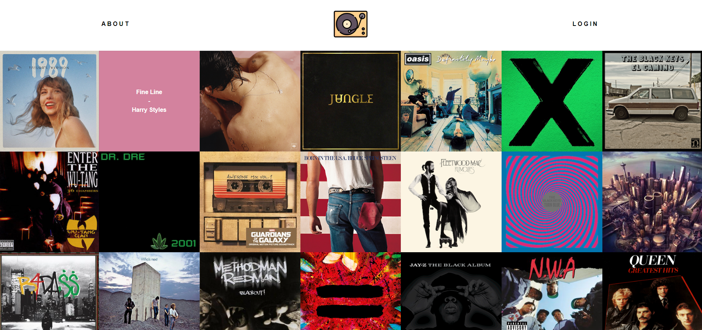
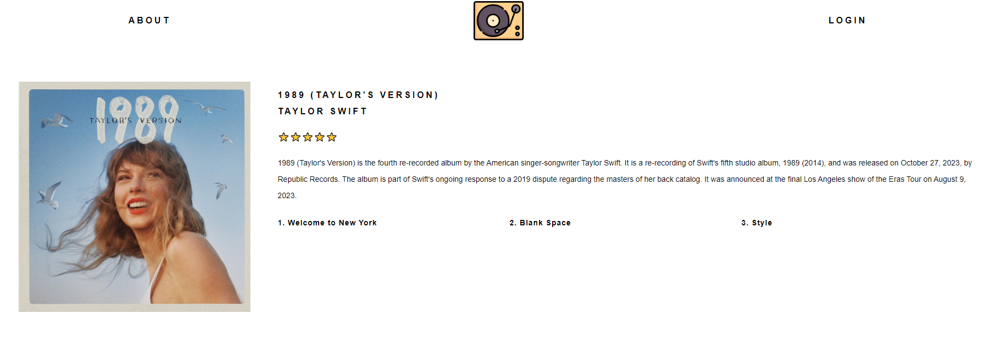

# React Records
---

This is a React app that displays all the vinyl records I have, mainly used as a personal libary.
Each record will have information about the album and a track list avaliable.

The Django Rest Framework is being used to serve all the data for the records using React on the frontend.

---
## This app is still under development and is not currently live. 

### Main page example

### Single page example

## TODO
- [ ] Add an About Page
- [ ] Add a "back" button to the single album page
- [ ] Collect the rest of the data for the albums
- [ ] Set up the front end of GH pages
- [ ] Host the API